<h1 align="center">Hi, I'm Seyit Ahmet 👋</h1>

  <b>Computer Engineering Student</b> @ Düzce University &nbsp;•&nbsp; <b>Co-founder & Mobile Developer</b> @ Pratech

  Building <b>QUP</b> — a fintech platform for digital receipts, loyalty & customer intelligence 📱

🚀 What I'm doing

🏗️ Leading mobile development at Pratech, building QUP with React Native CLI + TypeScript
🧠 Working across the stack — mobile, API security, OCR/LLM receipt parsing, push & analytics
🌱 TÜBİTAK 2209-A grant holder — GROW, a smart-agriculture project (LoRa IoT + accessibility)
🏆 Hackathon competitor & organizer (TEKNOFEST, Trendyol E-Commerce Hackathon, CODEXENERGY)
🌐 Ex–Network Engineer Intern @ Aselsannet — mobile tooling for remote switch management

🛠️ Tech I work with

Mobile toolkit: TanStack Query · Zustand · MMKV · react-hook-form + zod · OneSignal

🗓️ Contribution Calendar

  

🤝 Connect

Show Image
Show Image

<i>📍 Düzce · Istanbul — focused on fintech infrastructure, mobile, and Turkish AI.</i>

